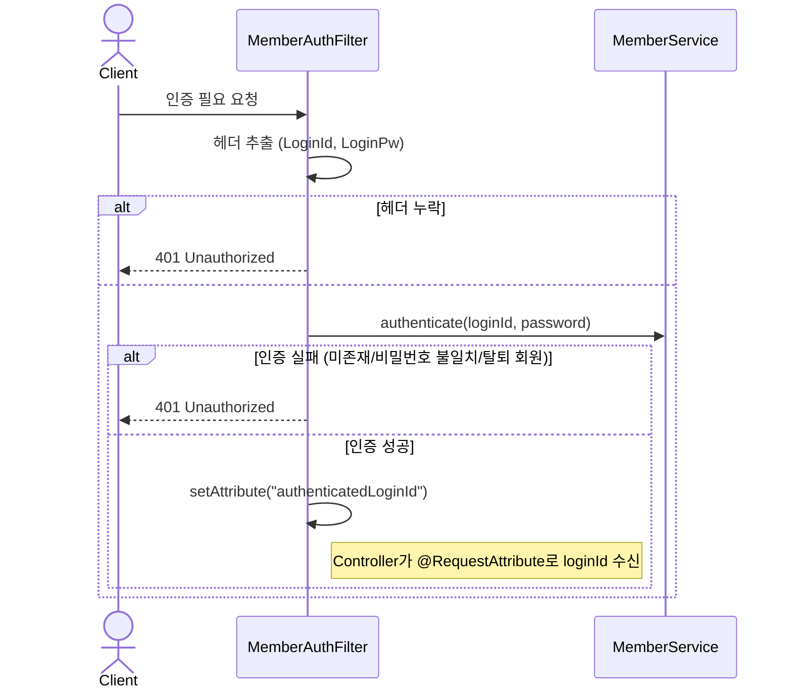
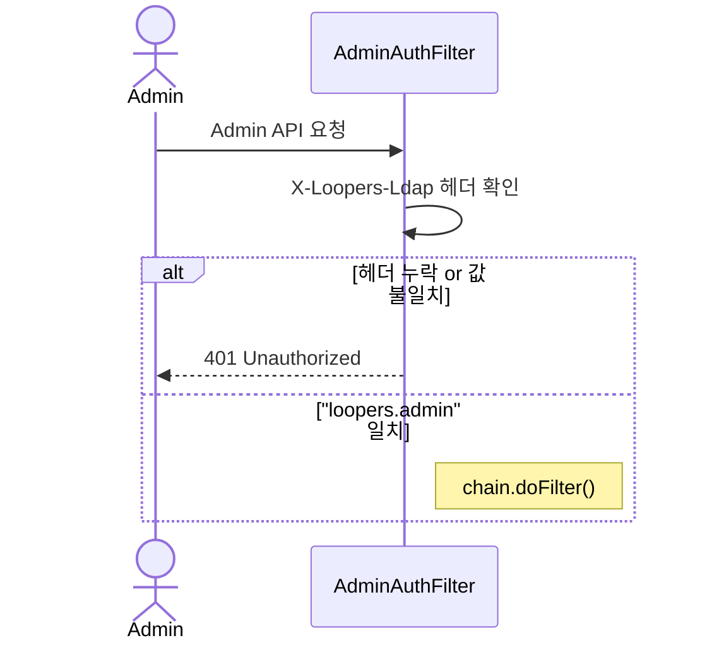
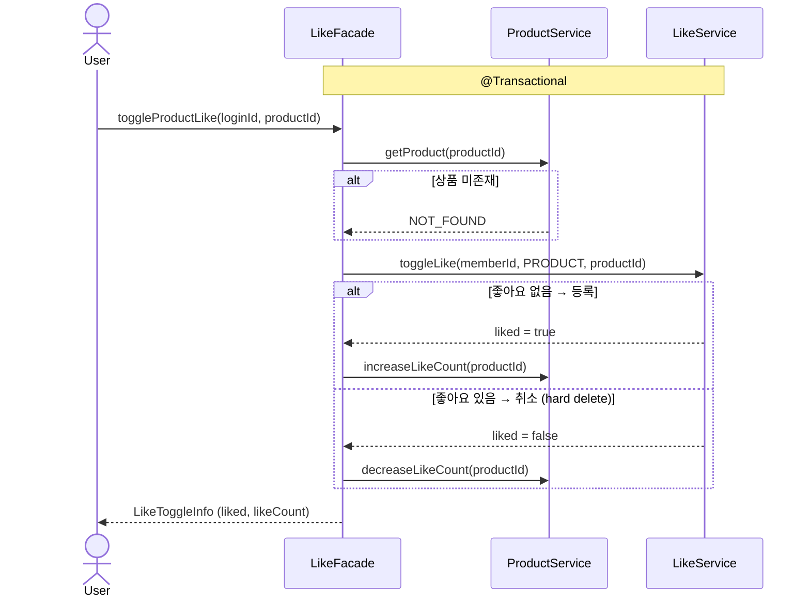
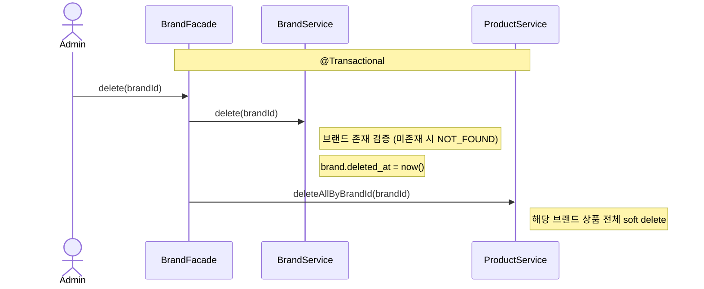
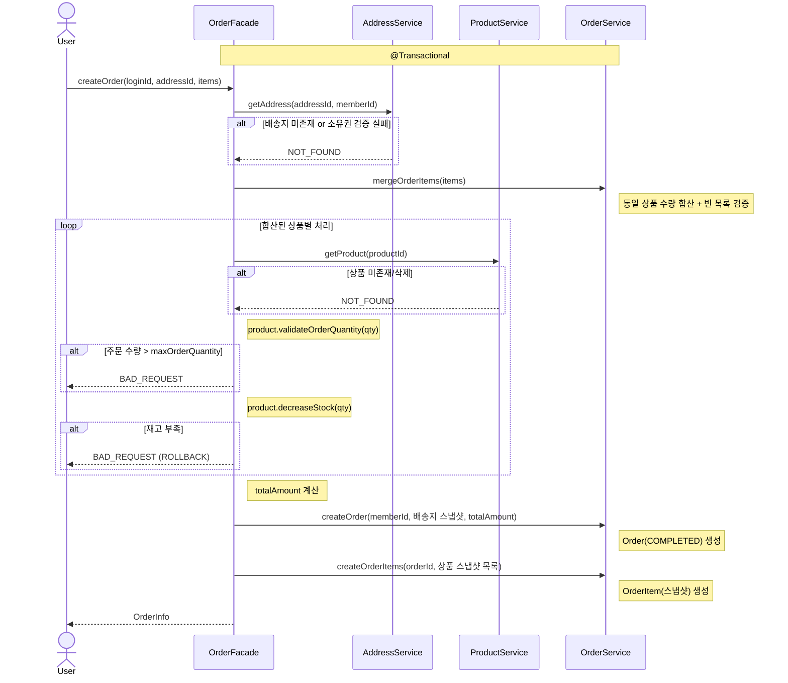
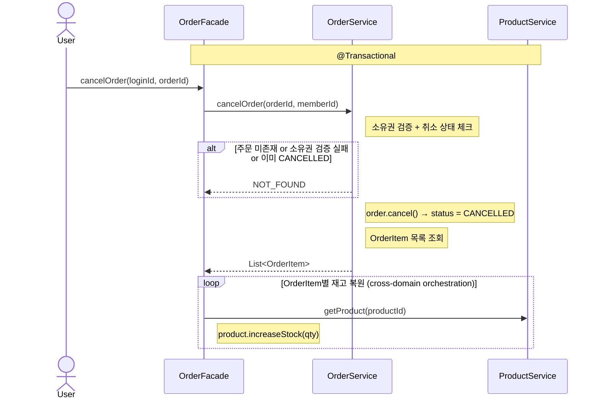

# 02. 시퀀스 다이어그램

## 목적

핵심 기능의 **조건 분기**, **트랜잭션 경계**, **다중 도메인 오케스트레이션**을 시각화하여 구현 전 설계를 검증한다.

---

## 다이어그램 선정 기준

**핵심 원칙**: "이 다이어그램이 없으면 코드만 보고 흐름을 파악하기 어려운가?"

| 포함 O | 포함 X |
|--------|--------|
| 조건 분기 (alt/opt) | API URL, HTTP method |
| 트랜잭션/에러 경계 | DTO 변환 로직 |
| 여러 서비스 조합 흐름 | 메서드 시그니처 상세 |
| 비동기/이벤트 발행 | 단순 위임 (Controller→Service 1:1) |

**제외된 흐름:**
- 상품 등록 (Admin): 단순 cross-domain 검증 (Brand 존재 확인 → Product 생성)
- 상품 목록 조회: 순수 읽기 (Reader 직행, 비즈니스 로직 없음)
- 주문 배송지 수정: 단일 도메인 상태 검증 (주문 취소와 동일 패턴)
- 단순 CRUD (Brand/Product/Address 등록·수정·삭제): 직선적 흐름

---

## 1. 인증 흐름

모든 인증 필요 API의 전제조건. Filter가 요청을 가로채 인증을 수행하며, 이후 흐름의 `authenticatedLoginId` 출처를 명확히 한다.

### 1-1. 회원 인증 (MemberAuthFilter)

### 1-2. 관리자 인증 (AdminAuthFilter)

**핵심 포인트:**
- Member 인증: 매 요청마다 loginId + password 검증 (세션/토큰 없음)
- 인증 성공 시 `authenticatedLoginId` (String)을 request attribute로 전달 → Controller에서 loginId로 수신 → Facade에서 Member 조회
- Admin 인증: LDAP 헤더 값만 확인, DB 조회 없음
- 인증 불필요: 상품/브랜드 조회 (URL 패턴 제외)
- 탈퇴(soft delete) 회원은 조회 시 제외 → 인증 실패

---

## 2. 좋아요 토글

Like 생성/삭제와 like_count 동기화가 하나의 트랜잭션에서 이루어져야 한다.
단일 `Like` 엔티티 + `LikeTargetType` enum으로 상품/브랜드 좋아요를 통합 처리한다.

**핵심 포인트:**
- 단일 POST 토글 (있으면 취소, 없으면 등록)
- like_count 증감은 동일 트랜잭션 내 처리
- 단일 `LikeFacade`/`LikeService`로 상품·브랜드 좋아요 모두 처리
- **브랜드 좋아요도 동일 패턴** (LikeFacade.toggleBrandLike → BrandService + LikeService)

---

## 3. 브랜드 삭제 (Cascade)

브랜드 삭제 시 해당 브랜드의 모든 상품도 함께 soft delete. 트랜잭션 범위와 cascade 영향을 명시한다.

**핵심 포인트:**
- Brand + Product 삭제가 하나의 트랜잭션 (부분 삭제 방지)
- 삭제된 상품의 기존 주문 스냅샷에는 영향 없음

---

## 4. 주문 생성

가장 복잡한 흐름. Address, Product, Order 여러 도메인이 하나의 트랜잭션에서 협력한다.

**핵심 포인트:**
- 배송지 소유권 검증 → 상품 검증·재고 차감 → 주문 생성 (순서 중요)
- 일부 상품 재고 부족 시 전체 롤백 (부분 성공 없음)
- OrderItem에 상품명/가격 스냅샷, Order에 배송지 스냅샷

---

## 5. 주문 취소

생성의 역방향. 상태 변경 후 재고 복원 순서가 중요하다.

**핵심 포인트:**
- 상태 변경 먼저 → 재고 복원 후속
- 이미 CANCELLED, 타인의 주문: 모두 NOT_FOUND (존재 비노출)

---

## 트랜잭션 경계 요약

| 기능 | 트랜잭션 소유자 | 참여 도메인 | 비고 |
|------|----------------|-------------|------|
| 인증 | MemberAuthFilter | Member | 트랜잭션 없음 |
| 좋아요 토글 | LikeFacade | Like, Product/Brand | like_count 동기화, 단일 Facade로 상품·브랜드 모두 처리 |
| 브랜드 삭제 | BrandFacade | Brand, Product | cascade soft delete |
| 상품 등록 | ProductFacade | Brand(검증), Product | 브랜드 존재 확인 |
| 주문 생성 | OrderFacade | Address, Product, Order | 재고 선차감, 실패 시 전체 롤백 |
| 주문 배송지 수정 | OrderFacade | Order | 상태 검증 (COMPLETED만) |
| 주문 취소 | OrderFacade | Order, Product | 상태 변경 후 재고 복원 |
| 기타 단일 도메인 CRUD | 각 Service | 단일 도메인 | |
