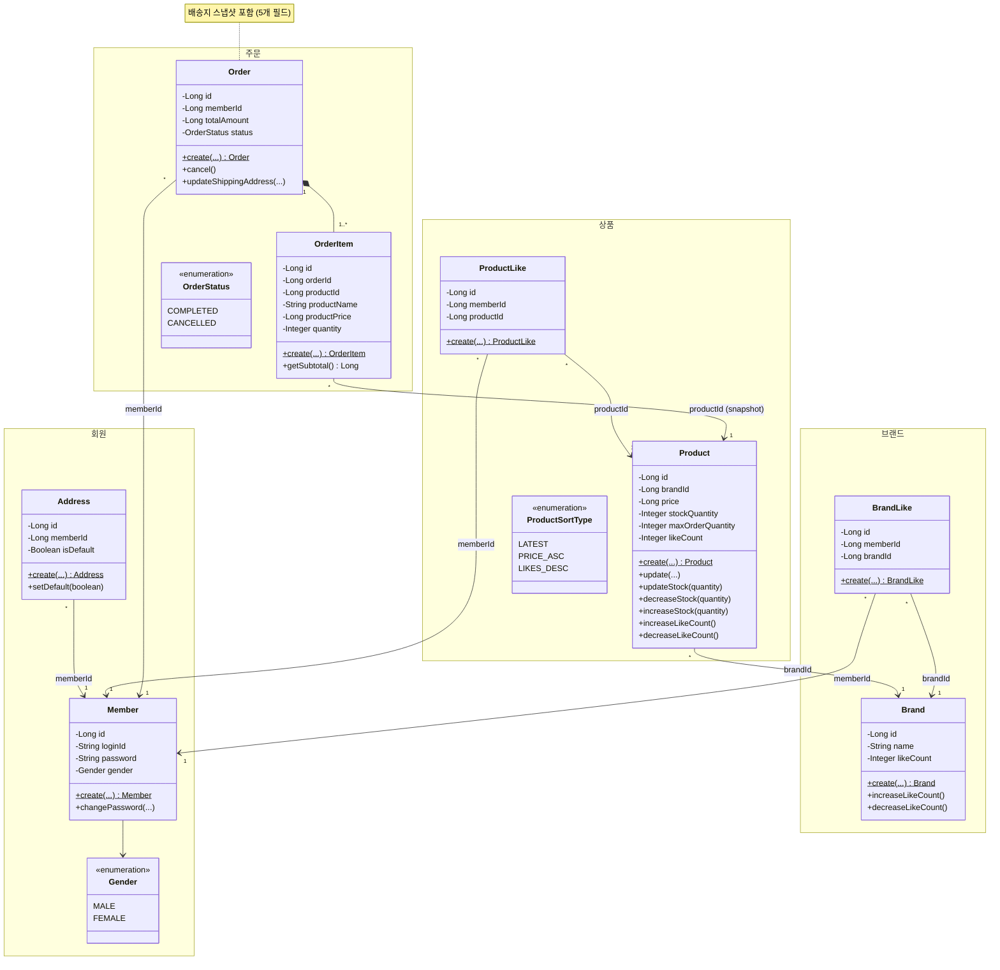

# 03. 클래스 다이어그램 (도메인 모델)

## 목적

각 도메인 객체의 **역할과 책임**, **의존 방향**, **Entity/VO 구분**을 정의한다.
Service에 로직이 집중되지 않도록 도메인 객체 간 메시지와 책임을 표현한다.

---

## 전체 도메인 모델

> **관계 키**, **상태 전이 필드**, **설계 의사결정 필드**만 표시. 단순 데이터 속성(email, description, phone 등)과 단순 setter 메서드는 생략 — 전체 필드는 04-erd.md 참조.



---

## 설계 해석

### 1. 책임 분배 원칙

| 위치 | 책임 |
|------|------|
| **Entity** | 생성 검증 (factory method), 상태 변경, 비즈니스 규칙 캡슐화 |
| **Service** | Entity 조회/저장 조율, Reader/Repository 사용 |
| **Facade** | 다중 도메인 협력 조율, 트랜잭션 경계 |

### 2. Entity에 위치하는 핵심 로직

**Address**
- `create()`: 필수 정보 검증 (수령인, 전화번호, 주소). isDefault는 파라미터로 수신 (첫 등록 여부는 Service에서 판단).
- `setDefault()`: 기본 배송지 지정/해제.

**Brand**
- `increaseLikeCount()`: 좋아요 수 1 증가.
- `decreaseLikeCount()`: 좋아요 수 1 감소. 0 미만 방지.

**Product**
- `updateStock(qty)`: qty >= 0 검증 후 재고 직접 설정. Admin 입고/재고 조정용.
- `decreaseStock(qty)`: 재고 >= qty 검증 후 차감. 도메인 불변식 보호.
- `increaseStock(qty)`: qty > 0 검증 후 증가.
- `update()`: 브랜드 변경 불가 — update에 brandId 파라미터 없음.
- `increaseLikeCount()`: 좋아요 수 1 증가.
- `decreaseLikeCount()`: 좋아요 수 1 감소. 0 미만 방지.

**Order**
- `cancel()`: COMPLETED 상태만 취소 가능. 상태 전이 불변식 보호.
- `create()`: 배송지 스냅샷 포함. totalAmount = 각 OrderItem의 subtotal 합산.
- `updateShippingAddress()`: COMPLETED 상태만 수정 가능. 원본 Address와 독립.

### 3. Entity vs Value Object 구분

| 객체 | 구분 | 근거 |
|------|------|------|
| Member | Entity | 고유 ID, 독립 생명주기 |
| Address | Entity | 고유 ID, 독립 생명주기 (Member 소유) |
| Brand | Entity | 고유 ID, 독립 생명주기 |
| Product | Entity | 고유 ID, 독립 생명주기 |
| ProductLike | Entity | 고유 ID, DB에 독립 저장 |
| BrandLike | Entity | 고유 ID, DB에 독립 저장 |
| Order | Entity | 고유 ID, 상태 전이 존재 |
| OrderItem | Entity (DB) / VO (개념) | DB 저장 필요하나 Order 없이 독립 존재 불가 |
| Gender | Enum | 성별 값 |
| ProductSortType | Enum | 정렬 기준 값 |
| OrderStatus | Enum | 주문 상태 값 |

### 4. 연관 관계 방향

모든 연관은 **단방향 ID 참조** (화살표: 의존하는 쪽 → 의존 대상):

| 관계 | 다중성 | 참조 방식 |
|------|--------|-----------|
| Address → Member | * : 1 | memberId |
| Product → Brand | * : 1 | brandId |
| ProductLike → Member | * : 1 | memberId |
| ProductLike → Product | * : 1 | productId |
| BrandLike → Member | * : 1 | memberId |
| BrandLike → Brand | * : 1 | brandId |
| Order → Member | * : 1 | memberId |
| Order ◆ OrderItem | 1 : 1..* | composition |
| OrderItem → Product | * : 1 | productId (snapshot) |

- JPA의 `@ManyToOne` 양방향 매핑은 사용하지 않음. ID 참조로 도메인 간 결합도를 낮춤.
- Order의 배송지: ID 참조 아닌 **값 스냅샷** (recipientName, recipientPhone, zipCode, address1, address2)

---

## 레이어별 구조 (도메인당)

```
domain/{domain}/
├── {Domain}.java              # Entity (생성 검증, 상태 변경)
├── {Domain}Reader.java        # 조회 인터페이스
├── {Domain}Repository.java    # 저장 인터페이스
└── {Domain}Service.java       # 도메인 서비스 (단일 도메인 조율)

infrastructure/{domain}/
├── {Domain}JpaRepository.java      # Spring Data JPA
├── {Domain}ReaderImpl.java         # Reader 구현
└── {Domain}RepositoryImpl.java     # Repository 구현

application/{domain}/
├── {Domain}Facade.java        # 유스케이스 조율 (다중 도메인)
└── {Domain}Info.java           # 전달 객체 (record)

interfaces/api/{domain}/
├── {Domain}V1Controller.java  # REST Controller
└── {Domain}V1Dto.java         # Request/Response DTO
```
