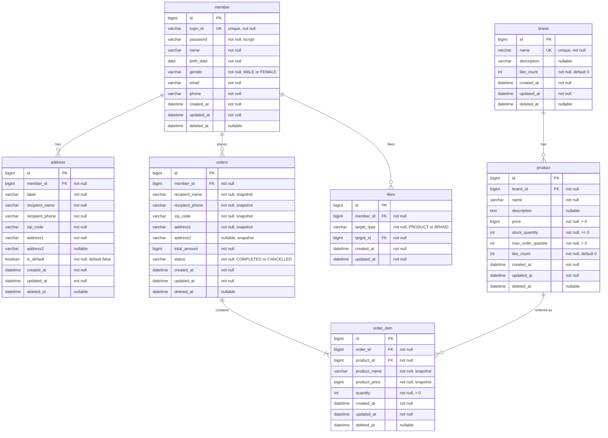

# 04. ERD (Entity Relationship Diagram)

## 목적

실제 저장이 필요한 데이터의 **테이블 구조**, **관계**, **제약조건**, **인덱스**를 정의한다.

---

## 설계 결정 사항

| 항목 | 결정 |
|------|------|
| enum 표현 | `VARCHAR` (코드 테이블 불필요, 현 규모에 적합) |
| 삭제 전략 | soft delete (`deleted_at` 컬럼) — BaseEntity 상속 |
| 금액 타입 | `BIGINT` (원 단위, 부동소수점 방지) |
| 타임스탬프 | `DATETIME(6)` (UTC 정규화) |
| ID 생성 | `BIGINT AUTO_INCREMENT` (GenerationType.IDENTITY) |
| FK 전략 | 물리 FK 미설정 — ERD의 FK 표기는 논리적 관계만 표현. JPA에서 ID 참조 (Long) 사용 |

---

## ERD

---

## 제약조건 및 인덱스

### member
- `UK: login_id` (unique)
- `INDEX: idx_member_name (name)` — Admin 회원 키워드 검색

### address
- `INDEX: idx_address_member_id (member_id)` — 내 배송지 목록 조회

### brand
- `UK: name` (unique) — 동일 브랜드명 방지 (UK가 검색 인덱스 겸용)

### product
- `INDEX: idx_product_brand_id (brand_id)` — 브랜드별 필터 조회
- `INDEX: idx_product_created_at (created_at)` — latest 정렬
- `INDEX: idx_product_like_count (like_count)` — likes_desc 정렬
- `INDEX: idx_product_price (price)` — price_asc 정렬
- `INDEX: idx_product_name (name)` — 상품명 키워드 검색

### likes
- `UK: uk_like_member_target (member_id, target_type, target_id)` — 동일 대상 중복 좋아요 방지 (leftmost prefix로 member_id 조회 겸용)

### orders
- `INDEX: idx_orders_member_id_created_at (member_id, created_at)` — 내 주문 목록 + 날짜 범위 필터

### order_item
- `INDEX: idx_order_item_order_id (order_id)` — 주문별 상품 조회

---

## 도메인 모델과 ERD 간 차이

| 차이 | 도메인 모델 | ERD | 이유 |
|------|-------------|-----|------|
| OrderItem | Order의 Value Object | 별도 테이블 (order_item) | 1:N 관계, 독립 저장 필요 |
| OrderItem.productName/Price | Product에서 가져옴 | snapshot 컬럼으로 저장 | 주문 시점 가격/이름 보존 |
| 테이블명 | Order | `orders` | `order`는 SQL 예약어 |
| like_count | Product/Brand 필드 | product.like_count, brand.like_count 컬럼 | 비정규화 (성능 최적화) |
| Order 배송지 | Address에서 가져옴 | orders에 snapshot 컬럼으로 저장 | 주문 시점 배송지 보존, 원본과 독립 |
| Like 구조 | 단일 Like 엔티티 (targetType + targetId) | `likes` 단일 테이블 | 다형성 참조로 상품/브랜드 좋아요 통합 |
| Like 삭제 | 토글 취소 시 삭제 | `deleted_at` 없음 (hard delete) | UK 충돌 방지, 토글 시 물리 삭제/재생성 |
| Like 생명주기 | BaseEntity 미상속 | 자체 id/createdAt/updatedAt 관리 | soft delete 불필요, 독립적 생명주기 |

---

## soft delete 정책

모든 테이블은 BaseEntity를 상속하여 `deleted_at` 컬럼을 가진다.
- 삭제 시: `deleted_at = now()` (물리 삭제 없음)
- 조회 시: `WHERE deleted_at IS NULL` 조건 사용
- 브랜드 삭제 시: 해당 브랜드의 상품도 `deleted_at` 설정 (cascade soft delete)
- **예외: likes** — BaseEntity 미상속. 토글 취소 시 hard delete (물리 삭제). UK 충돌 방지를 위해 `deleted_at` 컬럼 없음. 자체 id/createdAt/updatedAt만 관리.
